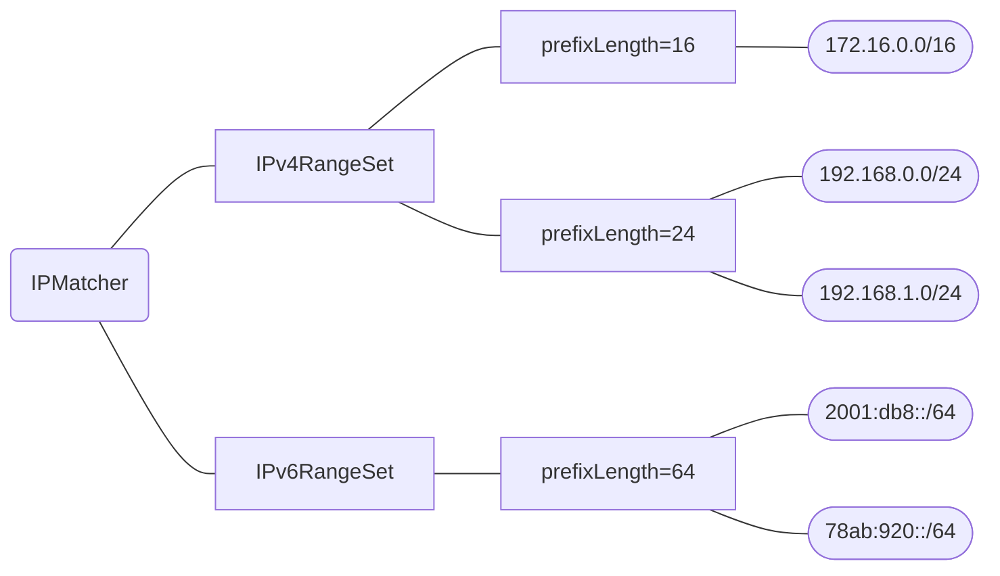

# ipfilter

`ipfilter` provides a matcher to filter IP addresses based on a list of CIDR ranges.
The matcher is optimized for speed and can handle a large number of ranges efficiently.

## Installation

    $ go get github.com/paralleltree/ipfilter

## Usage

```go
import (
  "fmt"
  "net"

  "github.com/paralleltree/ipfilter"
)

func example() {
  matcher, err := ipfilter.NewIPMatcher([]string{
    "192.168.0.0/24",
    "192.168.1.0/24",
  })
  if err != nil {
    panic(err)
  }

  ips := []string{
    "192.168.0.10",
    "192.168.20.10",
  }
  for _, ip := range ips {
    result := matcher.Match(net.ParseIP(ip))
    fmt.Printf("%s: %v\n", ip, result)
  }
  // Output:
  // 192.168.0.10: true
  // 192.168.20.10: false
}
```

## How it works
The matcher groups the given CIDR ranges by their prefix(subnet mask) length.
When matching an IP address, it tries to find the corresponding range from each group using a binary search.


